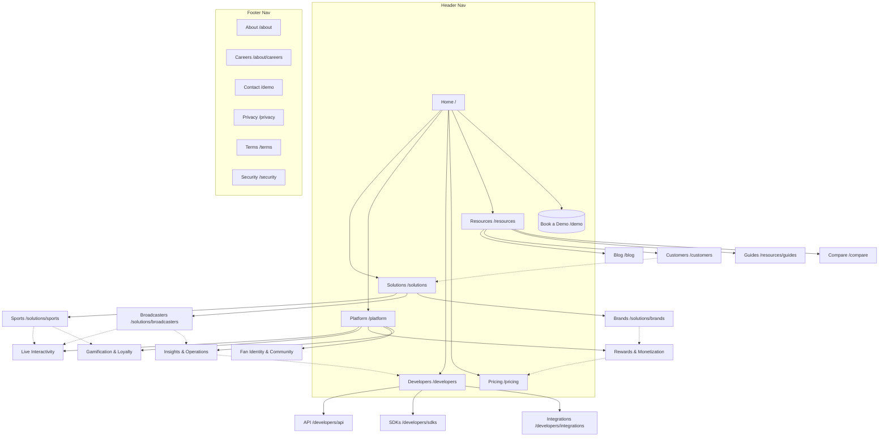

# Fanfinity Marketing Site - Proposed Site Architecture

> **Status: PROPOSED - NOT built this session.** This is an information-architecture plan for review, not an implementation. The live site today is a single "Coming Soon" placeholder (`index.md`); no marketing pages exist yet, so there are **no existing URLs to preserve or redirect**. All structure below is a recommendation to be approved before any page is built.

---

## 0. Context & Guardrail Notes

- **Site type:** SaaS marketing site (hybrid SaaS + resources/content), 2-3 levels deep.
- **Primary audiences (business/product buyers, lead with outcomes):** Sports leagues & teams; Broadcasters & media; Brands. **Secondary:** Developers/technical evaluators.
- **Top 3 site goals:** (1) Generate qualified demo requests, (2) Educate buyers on outcomes per vertical, (3) Build organic/SEO surface area around fan-engagement topics.
- **Stack note:** Built on Jekyll. URL patterns below assume clean, hyphenated, lowercase paths with a consistent **no-trailing-slash** policy (enforce one). `baseurl` is currently empty (root-hosted).
- **Brand tokens to apply:** Primary purple `#9969ff` (scale 50 `#f5f0ff` → 500 `#9969ff` → 950 `#351070`; `brand.foreground #7c4dff`). Headings = Poppins, body = Geist, code = Geist Mono. Dark-mode-ready (oklch theme). Logo = `logo.svg`.
- **Guardrail compliance:** No invented customers, logos, testimonials, metrics, or pricing appear below. Pricing model is **TBD / to confirm**. Any positioning vs. an alternative is framed as a **hypothesis "(to confirm)"** and competitor names are not used in Fanfinity capability copy. All Fanfinity capabilities below are described as Fanfinity's own. Items not grounded in source product specs or brand tokens are flagged **TBD / to confirm**.

---

## 1. Value Pillars (the spine of the site)

The 18 grounded product areas cluster into **five value pillars**. Platform/Features pages, vertical Solutions pages, and internal links all map back to these pillars.

| Pillar | What it covers (grounded product areas) | Buyer outcome |
|--------|------------------------------------------|---------------|
| **Live Interactivity** | Widgets, Programs, Spoiler Prevention, Reactions | Turn passive viewers into active participants during live moments and on-demand content. |
| **Gamification & Loyalty** | Quests, Streaks, Leaderboards, Badges, Status Tiers | Drive habitual return visits, activation, and season-long retention. |
| **Rewards & Monetization** | Rewards economy, Redemption Keys, Sponsorship | Incentivize valued behaviors and open sponsorship/redemption revenue paths. |
| **Fan Identity & Community** | Profiles & Identity, Flair, Reactions (social graph), blocking/moderation | One cross-platform fan identity with safety controls and social structure. |
| **Insights & Operations** | Analytics, Custom Themes, Applications (tenancy), IDs & Attributes | Prove engagement, theme to brand/sponsor, and run a secure multi-tenant program. |

---

## 2. Page Hierarchy (ASCII Tree)

```
Home (/)
├── Solutions (/solutions)                          [overview / hub]
│   ├── Sports Leagues & Teams (/solutions/sports)
│   ├── Broadcasters & Media (/solutions/broadcasters)
│   └── Brands (/solutions/brands)
├── Platform (/platform)                            [overview / hub, mapped to pillars]
│   ├── Live Interactivity (/platform/live-interactivity)
│   ├── Gamification & Loyalty (/platform/gamification-loyalty)
│   ├── Rewards & Monetization (/platform/rewards-monetization)
│   ├── Fan Identity & Community (/platform/fan-identity)
│   └── Insights & Operations (/platform/insights-analytics)
├── Developers (/developers)                        [hub; secondary track]
│   ├── API Overview (/developers/api)
│   ├── SDKs & Platforms (/developers/sdks)          (TBD / to confirm SDK lineup)
│   └── Integrations & Data (/developers/integrations)  (TBD / to confirm)
├── Pricing (/pricing)                              [model TBD / to confirm]
├── Resources (/resources)                          [hub]
│   ├── Blog (/blog)
│   │   └── [Category] (/blog/category/{slug})
│   ├── Customers (/customers)                       (TBD - no logos/quotes yet)
│   │   └── [Case study] (/customers/{slug})         (TBD / to confirm)
│   ├── Guides & eBooks (/resources/guides)          (TBD / to confirm)
│   └── Compare (/compare)                           (HYPOTHESIS pages - to confirm)
│       └── [vs. alternative] (/compare/{slug})      (to confirm)
├── About (/about)
│   ├── Company (/about) [self]
│   └── Careers (/about/careers)                     (TBD / to confirm)
├── Contact / Book a Demo (/demo)                    [primary conversion]
└── Legal
    ├── Privacy (/privacy)                           (TBD content)
    ├── Terms (/terms)                               (TBD content)
    └── Security (/security)                         (TBD / to confirm)
```

All primary pages are within the 3-click rule from Home.

---

## 3. Visual Sitemap (Mermaid)



---

## 4. URL Map Table

| Page | URL | Parent | Nav Location | Priority |
|------|-----|--------|--------------|----------|
| Home | `/` | — | Header (logo) | High |
| Solutions (hub) | `/solutions` | Home | Header dropdown parent | High |
| Sports | `/solutions/sports` | Solutions | Header dropdown | High |
| Broadcasters & Media | `/solutions/broadcasters` | Solutions | Header dropdown | High |
| Brands | `/solutions/brands` | Solutions | Header dropdown | High |
| Platform (hub) | `/platform` | Home | Header dropdown parent | High |
| Live Interactivity | `/platform/live-interactivity` | Platform | Header dropdown | High |
| Gamification & Loyalty | `/platform/gamification-loyalty` | Platform | Header dropdown | High |
| Rewards & Monetization | `/platform/rewards-monetization` | Platform | Header dropdown | High |
| Fan Identity & Community | `/platform/fan-identity` | Platform | Header dropdown | Medium |
| Insights & Operations | `/platform/insights-analytics` | Platform | Header dropdown | Medium |
| Developers (hub) | `/developers` | Home | Header | Medium |
| API Overview | `/developers/api` | Developers | Header dropdown | Medium |
| SDKs & Platforms | `/developers/sdks` | Developers | Header dropdown | Medium (TBD) |
| Integrations & Data | `/developers/integrations` | Developers | Header dropdown | Low (TBD) |
| Pricing | `/pricing` | Home | Header | High (model TBD) |
| Resources (hub) | `/resources` | Home | Header dropdown parent | Medium |
| Blog | `/blog` | Resources | Header dropdown / footer | Medium |
| Blog category | `/blog/category/{slug}` | Blog | In-section | Low |
| Blog post | `/blog/{slug}` | Blog | In-section | Low |
| Customers | `/customers` | Resources | Header dropdown | Medium (TBD content) |
| Case study | `/customers/{slug}` | Customers | In-section | Low (TBD) |
| Guides & eBooks | `/resources/guides` | Resources | Footer | Low (TBD) |
| Compare (hub) | `/compare` | Resources | Footer | Low (HYPOTHESIS) |
| Comparison page | `/compare/{slug}` | Compare | In-section | Low (to confirm) |
| About | `/about` | Home | Footer | Medium |
| Careers | `/about/careers` | About | Footer | Low (TBD) |
| Book a Demo / Contact | `/demo` | Home | Header CTA button | High |
| Privacy | `/privacy` | — | Footer | Low (TBD) |
| Terms | `/terms` | — | Footer | Low (TBD) |
| Security | `/security` | — | Footer | Low (TBD) |

---

## 5. Page-by-Page Specifications

Each spec lists: **Purpose · Primary audience · Key sections · Primary CTA · URL · Internal-linking notes.**

### 5.1 Home — `/`
- **Purpose:** Communicate what Fanfinity is (a fan/audience-engagement platform) and route each buyer type to their vertical and pillar pages; capture demo intent.
- **Primary audience:** All three buyer types (sports, broadcasters, brands); secondary developers.
- **Key sections:**
  1. Hero — outcome-led headline + subcopy + primary CTA. *Current placeholder tagline "The ultimate fan engagement system" and placeholder subcopy ("Empowering creators and fans to connect, interact, and grow together through powerful engagement tools.") are TBD / to confirm; replace with approved messaging.*
  2. "Who it's for" — three cards linking to Sports / Broadcasters / Brands.
  3. Value-pillar overview — five pillars (Live Interactivity, Gamification & Loyalty, Rewards & Monetization, Fan Identity & Community, Insights & Operations) linking to Platform pages.
  4. Outcome strip — participation, retention, monetization, insight (described as outcomes, not metrics — no numbers invented).
  5. Live-moment / second-screen explainer (Widgets + Programs + Spoiler Prevention).
  6. Developer teaser — "Built for builders: API & SDKs" linking to `/developers`. *(SDK lineup itself is TBD / to confirm — see §5.14.)*
  7. Social proof block — **TBD / to confirm** (no logos/testimonials until real ones exist; keep section hidden until substantiated — do not use placeholder customer claims).
  8. Closing CTA band — Book a demo.
- **Primary CTA:** **Book a demo** (`/demo`). Secondary: "Explore the platform" (`/platform`).
- **Internal links:** Out to all three Solutions pages, all five Platform pillars, Developers, Pricing. This is the top hub; everything links back here via logo.

### 5.2 Solutions (hub) — `/solutions`
- **Purpose:** Orient buyers by industry and route to the right vertical page; reinforce that the same platform serves all three.
- **Primary audience:** All buyers self-selecting their vertical.
- **Key sections:** Intro framing; three vertical cards (Sports, Broadcasters, Brands) with one-line outcome each; shared-pillar strip; CTA band.
- **Primary CTA:** Book a demo. Secondary: enter a vertical page.
- **URL:** `/solutions`
- **Internal links:** Down to the three vertical pages; across to Platform pillars; up to Home.

### 5.3 Sports Leagues & Teams — `/solutions/sports`
- **Purpose:** Show how leagues/teams drive matchday participation, season-long loyalty, and sponsor-ready moments.
- **Primary audience:** Sports leagues & teams (digital/fan-experience and sponsorship owners).
- **Key sections:**
  1. Vertical hero — matchday/second-screen outcome.
  2. Use cases — in-play polls/predictions/trivia during games (Widgets); season-long Leaderboards & Status Tiers; daily check-in Streaks; Spoiler Prevention so live-stream viewers who are behind aren't spoiled by those ahead.
  3. Sponsorship moments — Sponsorship + Custom Themes for branded, sponsor-attached engagement (monetizable inventory).
  4. Outcomes — participation, retention, sponsor value (qualitative; no invented metrics).
  5. CTA band.
- **Primary CTA:** Book a demo. Secondary: "See Live Interactivity" (`/platform/live-interactivity`).
- **Internal links:** To Live Interactivity, Gamification & Loyalty, Rewards & Monetization pillars; to Customers (when available); to Pricing.

### 5.4 Broadcasters & Media — `/solutions/broadcasters`
- **Purpose:** Show how broadcasters map content schedules to interactive experiences and prove engagement to stakeholders.
- **Primary audience:** Broadcasters & media (product, audience, ad/sponsorship teams).
- **Key sections:**
  1. Hero — keep audiences in-app across live and on-demand content.
  2. Use cases — Programs as the container that maps a unit of content (live stream, episode, etc.) to interactive Widgets; live + on-demand widget delivery; Spoiler Prevention for live streams; Analytics to prove reach/engagement.
  3. Branding/theming for each show or sponsor (Custom Themes, Sponsorship).
  4. Insights — Standard + Visual Analytics for content and audience decisions.
  5. CTA band.
- **Primary CTA:** Book a demo. Secondary: "See Insights & Operations" (`/platform/insights-analytics`).
- **Internal links:** To Live Interactivity, Insights & Operations pillars; to Developers (content/scheduling integration via custom IDs); to Pricing.

### 5.5 Brands — `/solutions/brands`
- **Purpose:** Show how brands run promotional campaigns, loyalty, and rewards-driven engagement.
- **Primary audience:** Brand marketing / loyalty teams.
- **Key sections:**
  1. Hero — campaign and loyalty outcomes.
  2. Use cases — promotional Quests (with A/B testing), Rewards economy, Redemption Keys for giveaways/merch, Badges/Status Tiers for recognition and VIP.
  3. Monetization & redemption — Reward Store catalog and cash-out (Prizeout) for monetization-enabled reward items.
  4. Brand consistency — Custom Themes and Flair for identity/status.
  5. CTA band.
- **Primary CTA:** Book a demo. Secondary: "See Rewards & Monetization" (`/platform/rewards-monetization`).
- **Internal links:** To Gamification & Loyalty, Rewards & Monetization, Fan Identity & Community pillars; to Pricing.

### 5.6 Platform (hub) — `/platform`
- **Purpose:** Single overview of the full capability set organized by the five value pillars; the spine that connects features to outcomes.
- **Primary audience:** All buyers in evaluation; technical evaluators secondary.
- **Key sections:** Intro; five pillar cards (each linking to its detail page); "how it fits together" diagram (Applications → Profiles → Programs → Widgets → Rewards/Leaderboards); developer teaser; CTA band.
- **Primary CTA:** Book a demo. Secondary: enter a pillar page.
- **URL:** `/platform`
- **Internal links:** Down to all five pillar pages; across to Solutions; to Developers; up to Home.

### 5.7 Platform — Live Interactivity — `/platform/live-interactivity`
- **Purpose:** Detail real-time and on-demand interactive experiences.
- **Primary audience:** Sports & broadcasters primarily; all buyers.
- **Key sections:** Widgets (library: Polls, Image Slider, Trivia/Quiz, Predictions, Number Prediction, Cheer Meter, Alerts, Ask, Social Embeds); two-step create-then-publish flow with scheduling; real-time delivery so subscribed clients show widgets live; three presentation modes (Popup, Timeline, Embedded); Programs as the container for interactivity; Spoiler Prevention; Reactions across any content; reporting/moderation.
- **Primary CTA:** Book a demo. Secondary: "Build with the API" (`/developers/api`).
- **Internal links:** To Sports & Broadcasters solutions; to Insights & Operations (impression/engagement metrics); to Custom Themes within Insights & Operations.

### 5.8 Platform — Gamification & Loyalty — `/platform/gamification-loyalty`
- **Purpose:** Detail mechanics that drive activation, habit, and retention.
- **Primary audience:** All buyers; brands and sports especially.
- **Key sections:** Quests (tasks completed in any order, eligibility windows/profile groups, A/B testing, one-time rewards); Streaks (Periodic + Consecutive Action, milestones, freezing, timezone-aware, CSV-driven targets); Leaderboards (auto-updating from rewards earned in linked programs; all-time/seasonal/single-event; Views); Badges (earned by reward-item threshold or quest completion, or awarded directly); Status Tiers (Tier Groups, thresholds, benefits, assignment that grants all lower tiers).
- **Primary CTA:** Book a demo. Secondary: "See Rewards & Monetization."
- **Internal links:** To Rewards & Monetization (rewards feed these mechanics); to all three Solutions pages; to Insights & Operations (funnel/completion analytics).

### 5.9 Platform — Rewards & Monetization — `/platform/rewards-monetization`
- **Purpose:** Detail the rewards economy and monetization/sponsorship surfaces.
- **Primary audience:** Brands and sponsorship owners; all buyers.
- **Key sections:** Rewards (Items, Actions — built-in and custom, Reward Tables, capping/rate limiting, balances, credit/debit, transfer/gifting, transaction history); Redemption (Reward Store catalog; Prizeout cash-out for monetization-enabled reward items); Redemption Keys (codes, status, optional profile assignment); Sponsorship (sponsor identity — name, image, brand color — linked to programs/quests and surfaced to apps). *Sponsor create/update/delete is managed in the producer UI, not via a documented REST endpoint — only listing sponsors is documented (TBD / to confirm for messaging).*
- **Primary CTA:** Book a demo. Secondary: "Talk to us about pricing" (`/pricing`).
- **Internal links:** To Gamification & Loyalty; to Brands solution; to Pricing.

### 5.10 Platform — Fan Identity & Community — `/platform/fan-identity`
- **Purpose:** Detail the identity, social, and safety layer underpinning everything else.
- **Primary audience:** All buyers; technical evaluators secondary.
- **Key sections:** Profiles & Identity (one cross-platform profile, anonymous-then-linked on signup/login, immutable Profile ID + optional changeable custom ID, OAuth 2 Bearer token model); blocking (mutual, system-enforced across comments, chat, chatroom, and social graph); directed social graph (e.g. follow); Flair (reusable labels/scopes, manual or automated assignment); Reactions social-graph filtering.
- **Primary CTA:** Book a demo. Secondary: "See identity in the API" (`/developers/api`).
- **Internal links:** To Developers; to Live Interactivity (reactions/moderation); to all Solutions.

### 5.11 Platform — Insights & Operations — `/platform/insights-analytics`
- **Purpose:** Detail how operators prove engagement and run the platform securely at scale.
- **Primary audience:** Broadcasters & leagues (measurement, ROI); ops/IT secondary.
- **Key sections:** Analytics (Standard reports available to all; Visual Analytics dashboards as an add-on — DAU/WAU/MAU, widget engagement, quest funnels, chat volume; Analytics API for programmatic access via an API key); per-widget metrics (impression counts, unique impressions/reach, engagement counts); Custom Themes (cross-platform JSON theme reused across platforms, per-sponsor re-skin, accessibility/alternate styles); Applications (multi-tenant root; Client ID/Secret; OAuth 2.0 Bearer access tokens); IDs & Attributes (custom IDs, queryable attributes, custom data for integration). *Commercial packaging of Visual Analytics / Analytics API as a priced add-on is TBD / to confirm (source confirms add-on status, not pricing).*
- **Primary CTA:** Book a demo. Secondary: "Explore the API" (`/developers/api`).
- **Internal links:** To Developers; to Broadcasters solution; to Pricing (analytics add-on note).

### 5.12 Developers (hub) — `/developers`
- **Purpose:** Give technical evaluators a credible, secondary track to assess integration; reassure buyers it's developer-friendly.
- **Primary audience:** Developers / technical evaluators (secondary track).
- **Key sections:** Intro (REST API-first, multi-tenant, SDK-delivered client UI); API overview card; SDKs card; Integrations & data card; auth model summary (OAuth 2 Bearer tokens; Client Secret server-side only). *Specific SDK lineup, docs portal URL, and any GraphQL/MCP availability for Fanfinity = TBD / to confirm.*
- **Primary CTA:** **Read the docs / Get API access** — *destination TBD / to confirm*; fallback CTA = Book a demo.
- **Internal links:** To API, SDKs, Integrations; up to Platform pillars (esp. Fan Identity, Insights & Operations); to Applications concept.

### 5.13 Developers — API Overview — `/developers/api`
- **Purpose:** Summarize the REST API model and core resources without front-loading internals for business buyers.
- **Primary audience:** Developers.
- **Key sections:** Resource model (Applications → Profiles → Programs → Widgets → Rewards/Leaderboards/Badges/etc.); auth (OAuth 2 Bearer; Client Secret server-side; Profile vs. Admin/Producer access tokens); custom IDs & attributes for lookups; link to full docs (TBD / to confirm).
- **Primary CTA:** Read the docs (TBD). Secondary: Book a demo.
- **Internal links:** To SDKs, Integrations; to Fan Identity & Insights pillars.

### 5.14 Developers — SDKs & Platforms — `/developers/sdks`
- **Purpose:** State supported client platforms and delivery model.
- **Primary audience:** Mobile/web engineers.
- **Key sections:** Supported SDKs/platforms — **TBD / to confirm** (do not assert specific platform support until grounded for Fanfinity); SDK/config-delivered capabilities noted in source (Custom Themes and Spoiler Prevention are delivered via SDK/client configuration, not REST endpoints); theming JSON saved in a standard format and reused across platforms.
- **Primary CTA:** Read the docs (TBD). Secondary: Book a demo.
- **Internal links:** To API; to Custom Themes (Insights & Operations) and Live Interactivity (Spoiler Prevention).

### 5.15 Developers — Integrations & Data — `/developers/integrations`
- **Purpose:** Explain how Fanfinity fits existing CMS/EPG/stats/user systems and data tooling.
- **Primary audience:** Platform/data engineers.
- **Key sections:** IDs & Attributes patterns (custom IDs for one-to-one mapping such as user→profile and content→program from your CMS/EPG/DAM/stats provider; queryable attributes for one-to-many; custom data for memoized context); Programs scheduling hooks (start/stop emit a status-updated pubsub event integrations can listen for). *Specific named third-party integrations (e.g. CDP/Segment/mParticle) = TBD / to confirm for Fanfinity.*
- **Primary CTA:** Read the docs (TBD). Secondary: Book a demo.
- **Internal links:** To API; to Insights & Operations; to Broadcasters solution (content/EPG mapping).

### 5.16 Pricing — `/pricing`
- **Purpose:** Set commercial expectations and route to sales; capture intent.
- **Primary audience:** Economic buyers across all verticals.
- **Key sections:** **Pricing model = TBD / to confirm.** Until confirmed: value framing by use case; "what's included" by pillar; add-on note for Visual Analytics / Analytics API (*packaging/pricing TBD / to confirm*); enterprise/multi-tenant note; FAQ; "Contact sales for a quote" block. **No dollar amounts, no named tiers, no metered/MAU pricing claims** until grounded for Fanfinity.
- **Primary CTA:** **Book a demo / Talk to sales** (`/demo`).
- **Internal links:** From every Platform and Solutions page; to Demo; to Rewards & Monetization and Insights & Operations (add-on context).

### 5.17 Resources (hub) — `/resources`
- **Purpose:** Central hub for educational content, proof, and comparison; SEO surface.
- **Primary audience:** Buyers in research; organic search visitors.
- **Key sections:** Featured content; links to Blog, Customers, Guides, Compare.
- **Primary CTA:** Subscribe / Book a demo.
- **URL:** `/resources`
- **Internal links:** Down to Blog/Customers/Guides/Compare; across to Solutions and Platform from individual pieces.

### 5.18 Blog — `/blog` (posts `/blog/{slug}`, categories `/blog/category/{slug}`)
- **Purpose:** Educate on fan-engagement topics; rank for buyer keywords; feed pillar pages (hub-and-spoke).
- **Primary audience:** Search visitors; buyers in research.
- **Key sections:** Post list; category filters; per-post body with contextual links and a related-posts block.
- **Primary CTA:** Book a demo (in-post and end-of-post). Secondary: related content.
- **Internal links:** Posts link up to relevant Platform pillar and Solutions pages (spokes → hub). No dates in URLs.

### 5.19 Customers — `/customers` (case studies `/customers/{slug}`)
- **Purpose:** Provide social proof and outcome stories.
- **Primary audience:** Buyers in evaluation.
- **Key sections:** **TBD / to confirm — no real customers, logos, testimonials, or metrics may be published until they exist.** Build the page shell now; keep it unpublished or use a neutral "case studies coming soon" state rather than placeholders that imply real customers.
- **Primary CTA:** Book a demo.
- **Internal links:** Each case study links to the relevant Solution and Platform pages; Solutions pages link here once populated.

### 5.20 Guides & eBooks — `/resources/guides`
- **Purpose:** Gated/ungated long-form lead magnets. **TBD / to confirm whether gated.**
- **Primary audience:** Buyers in research; lead capture.
- **Key sections:** Guide list; download/lead form (TBD).
- **Primary CTA:** Download (lead capture) or Book a demo.
- **Internal links:** To related Platform pillars and Blog posts.

### 5.21 Compare (hub) — `/compare` (pages `/compare/{slug}`)
- **Purpose:** Capture comparison-intent search traffic. **HYPOTHESIS / to confirm whether to publish at all.**
- **Primary audience:** Late-stage buyers comparing alternatives.
- **Key sections:** Neutral, factual capability comparison. **Guardrail-critical:** describe Fanfinity capabilities as its own (never named after another vendor); any claimed Fanfinity advantage must be framed as a hypothesis "(to confirm)" and never stated as fact; do not misrepresent any competitor. **No specific differentiator angle (deployment model, performance posture, pricing transparency, or otherwise) is asserted here** — none is grounded in the current Fanfinity product specs. Any such angle is **TBD / to confirm** and must be substantiated before it appears on a page.
- **Primary CTA:** Book a demo.
- **Internal links:** To Pricing and relevant Platform pillars.

### 5.22 About — `/about`
- **Purpose:** Establish company credibility and mission.
- **Primary audience:** All buyers; press; candidates.
- **Key sections:** Mission/story (TBD copy); what we build; team/leadership (TBD); careers link.
- **Primary CTA:** Book a demo. Secondary: View careers.
- **Internal links:** To Careers, Contact; to Platform.

### 5.23 Careers — `/about/careers`
- **Purpose:** Recruiting. **TBD / to confirm whether in scope.**
- **Primary audience:** Candidates.
- **Key sections:** Roles list (TBD); culture; how to apply.
- **Primary CTA:** Apply (TBD).
- **Internal links:** To About.

### 5.24 Contact / Book a Demo — `/demo`
- **Purpose:** **Primary conversion page** — capture qualified demo/sales requests.
- **Primary audience:** All buyers ready to talk.
- **Key sections:** Value recap; demo request form (name, company, role, vertical select: Sports / Broadcaster / Brand, use case, message); what to expect; alternative contact details (TBD); optional scheduling/booking embed (TBD).
- **Primary CTA:** **Submit / Book demo.**
- **Internal links:** Linked from the header CTA and every page's closing CTA band and footer. Vertical select should align with the three Solutions pages.

### 5.25 Legal — `/privacy`, `/terms`, `/security`
- **Purpose:** Compliance, trust, and enterprise procurement readiness.
- **Primary audience:** Buyers' legal/security/procurement; all users.
- **Key sections:** Standard legal copy — **all TBD / to confirm content.** `/security` (trust posture; multi-tenant Application isolation framing) is recommended for enterprise/rights-holder buyers but **content TBD**.
- **Primary CTA:** None (utility). Footer links only.
- **Internal links:** Footer-wide; `/security` may link to Applications (multi-tenant isolation) on the Insights & Operations page.

---

## 6. Navigation Spec

### Header (6 links + CTA, CTA rightmost)
1. **Logo** (`logo.svg`) → `/`
2. **Solutions** (dropdown) → Sports · Broadcasters · Brands · (link: Solutions overview)
3. **Platform** (dropdown/mega-menu, grouped by pillar) → Live Interactivity · Gamification & Loyalty · Rewards & Monetization · Fan Identity & Community · Insights & Operations
4. **Developers** (dropdown) → API · SDKs · Integrations
5. **Pricing** → `/pricing`
6. **Resources** (dropdown) → Blog · Customers · Guides · Compare
7. **Book a Demo** — primary CTA button, brand purple `#9969ff`, rightmost.

> Keep the primary nav to these 6 links + CTA. The Platform mega-menu should be max 3-4 columns (group the five pillars across columns).

### Footer (4 columns + legal row)
- **Platform:** Live Interactivity · Gamification & Loyalty · Rewards & Monetization · Fan Identity & Community · Insights & Operations
- **Solutions:** Sports · Broadcasters · Brands · Pricing
- **Developers:** API · SDKs · Integrations
- **Company / Resources:** About · Careers (TBD) · Blog · Customers · Guides · Compare · Contact
- **Legal row:** Privacy · Terms · Security · © Fanfinity. Logo + brief one-line descriptor.

### Sidebar nav
- Use within **Blog** (category filters) and, if a docs portal is added later, within **Developers** docs. Marketing pages do not need a sidebar.

### Breadcrumbs
- Implement on all L2+ pages, mirroring the URL path. Examples:
  - `/platform/live-interactivity` → **Home > Platform > Live Interactivity**
  - `/solutions/sports` → **Home > Solutions > Sports**
  - `/blog/{slug}` → **Home > Blog > {Category} > {Post Title}**
  - `/customers/{slug}` → **Home > Customers > {Customer}**
- Every breadcrumb segment is a link except the current page. Add `BreadcrumbList` structured data (defer to schema work).

---

## 7. Internal Linking Plan

### Hub-and-spoke
- **Platform (`/platform`) is the capability hub.** Each pillar page is a spoke that links back to `/platform` and across to the two most-related pillars (e.g., Gamification ↔ Rewards; Live Interactivity ↔ Insights).
- **Solutions (`/solutions`) is the audience hub.** Each vertical page links back up and to the 2-3 pillars most relevant to it (table below).
- **Blog (`/blog`) is the content hub.** Posts (spokes) link up to the relevant Platform pillar or Solutions page; pillar pages can feature top posts. Posts link to each other within a topic cluster.

### Vertical → Pillar cross-links (primary)
| Solution page | Links to pillars |
|---------------|------------------|
| Sports | Live Interactivity, Gamification & Loyalty, Rewards & Monetization |
| Broadcasters | Live Interactivity, Insights & Operations, (Developers for content/scheduling integration) |
| Brands | Gamification & Loyalty, Rewards & Monetization, Fan Identity & Community |

### High-value link targets (most inbound links)
1. **`/demo`** — linked from header CTA, every page's closing CTA band, and footer (highest priority).
2. **`/platform`** and the five pillar pages — from Home, Solutions, Blog, Developers.
3. **`/pricing`** — from Home, every Platform pillar, every Solutions page.

### Cross-section opportunities
- Pillar pages → relevant **Customers** case studies (once published).
- **Insights & Operations** and **Fan Identity** pillars → **Developers** (technical depth).
- **Rewards & Monetization** → **Pricing** (add-on/packaging context).
- **Broadcasters** solution → **Developers / Integrations** (content/EPG mapping via custom IDs).

### Orphan-page audit
- New site, so no existing orphans. **Rule going forward:** every published page must have ≥1 inbound internal link. Watch the typically-orphaned pages: `/security`, `/about/careers`, individual `/compare/{slug}` and `/customers/{slug}` pages — ensure each is linked from its hub and footer.

### Anchor-text guidance
- Use descriptive anchors ("explore live interactivity," "see how broadcasters use Fanfinity"), never "click here." Describe Fanfinity capabilities under Fanfinity's own name; never label them after another vendor.

---

## 8. Open Items / TBD Register (must confirm before build)

| Item | Status |
|------|--------|
| Final tagline & hero subcopy (replace placeholder) | TBD / to confirm |
| Pricing model, tiers, and any metered/usage basis | TBD / to confirm — **no numbers until grounded** |
| Analytics packaging (Visual Analytics / Analytics API pricing as a priced add-on) | To confirm (source confirms add-on status; commercial packaging/pricing unconfirmed) |
| Fanfinity SDK lineup, docs portal URL, GraphQL/MCP availability | TBD / to confirm — do not assert specifics |
| Named third-party integrations (CDP/Segment/mParticle, etc.) | TBD / to confirm |
| Customers, logos, testimonials, metrics | None exist — keep `/customers` unpublished/neutral until real |
| Whether to publish `/compare/*` and any differentiator claims | HYPOTHESIS — no differentiator angle is grounded yet; each must be substantiated and labeled "(to confirm)" before use |
| API-level sponsor create/update/delete (only the list endpoint is documented; create/update/delete is UI-managed) | TBD / to confirm |
| Careers, Security, Guides scope | TBD / to confirm |
| Trailing-slash policy + `baseurl`/hosting (currently root) | Decide and enforce one policy |

---

**Reminder: PROPOSED architecture only — NOT built this session.** No pages, routes, redirects, or nav were created or modified. This document lives at `docs/marketing/site-architecture.md`.
